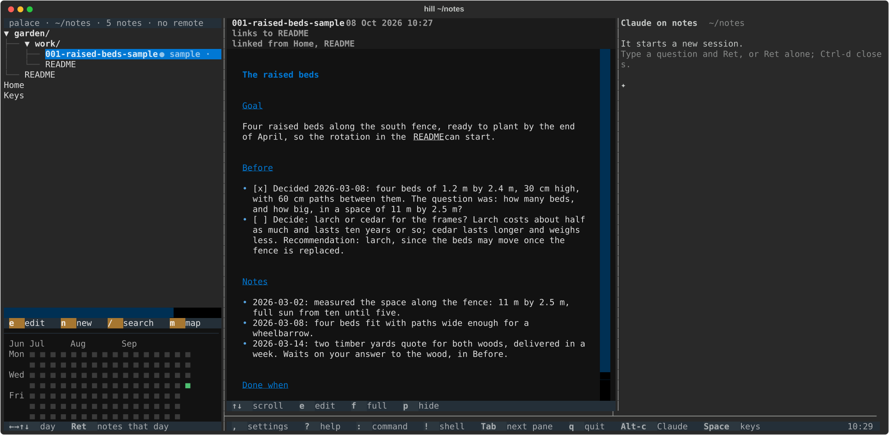

# palace

A notes screen for a Markdown vault, with micro for editing and Claude in
micro. It runs above the strip of [hill-ops](https://github.com/ropsten-ou/hill-ops/blob/main/README.md), which holds its
settings, with its preview and Claude on the note in panes of their own
beside it; micro opens there too.



## Getting started

On PyPI palace is `hill`, and so is the command you type.

### What it needs

- [uv](https://docs.astral.sh/uv/), which installs palace and the Python
  it runs on (3.11 or later).
- [tmux](https://github.com/tmux/tmux), which hill-ops, the strip, runs
  palace in.
- [micro](https://micro-editor.github.io), the editor `e` opens a note in.
- [Claude Code](https://claude.com/claude-code), signed in, for Claude's
  pane beside the preview.
- For Claude in micro and in the strip:
  [`claude-agent-acp`](https://www.npmjs.com/package/@agentclientprotocol/claude-agent-acp),
  from npm, and the micro plugin
  [micro-claude](https://github.com/ropsten-ou/micro-claude/blob/main/README.md).

On macOS, with Homebrew:

```bash
brew install uv tmux micro
npm install -g @agentclientprotocol/claude-agent-acp
git clone https://github.com/ropsten-ou/micro-claude ~/.config/micro/plug/claude
```

On Debian or Ubuntu, `sudo apt install tmux micro`, and uv from its
[installer](https://docs.astral.sh/uv/getting-started/installation/);
the other two lines are the same. palace runs without micro or Claude
Code; only what uses them doesn't (`e` says micro isn't installed).

### Quickstart

1. Install what it needs, above.
2. `uv tool install hill`, which brings hill-ops, the strip, along.
3. `hill` in a terminal. The first time, it asks which folder of notes
   to show: Ret alone makes `~/notes`, a few notes to try it on (or
   takes `~/projects`, if you have one).
4. Look around: select the garden's work item, and the preview shows
   it, with Claude's pane beside it; `e` opens it in micro, `,` opens
   the settings in the strip, `?` the help, `q` quits.
5. For a folder of your own, `hill FOLDER` shows it this time; to keep
   it, set `folder` in `~/.config/palace/settings.json`, or take
   `folder` out to be asked again.

What follows says how palace works: each part of the screen, work items,
the settings, and how to work on palace itself. Every key, command and
setting, with its choices and default, is in [the
reference](docs/reference.md), generated from what palace declares.

## Running palace

```bash
uv tool install hill   # palace, with hill-ops under it
ln -s ~/projects/hill/bin/shim ~/.local/bin/hill         # or from this folder
ln -s ~/projects/hill/bin/shim ~/.local/bin/palace
ln -s ~/projects/hill/bin/shim ~/.local/bin/palace-loop
hill              # the notes screen, for the folder chosen on the first start
hill FOLDER       # ... or for another folder, this time
```

On PyPI palace is `hill`, and so is its command; `palace` is a second name
for the same command. It brings along `hill-ops`, the strip it runs above
([hill-ops](https://github.com/ropsten-ou/hill-ops/blob/main/README.md)), and `hill-mdvault`, its vault package. The
imports are `hill`, `hill_ops` and `mdvault`; its folder and repo are `hill` too.

`bin/shim` runs the command its link is named after from palace's own
`.venv`, after `uv sync` has brought `.venv` in line with `uv.lock`, so a
changed dependency is installed at the next start. A `uv tool install` copy
doesn't update, and broke palace when wrap-client became hill-client.

palace starts itself inside hill-ops, from its own environment, when it runs
in a terminal, so the settings are in the strip under it; `PALACE_NO_HILL=1`
keeps it on its own.

Each palace in hill-ops keeps a layout of its own in hill-ops's instance (see
[Instances](https://github.com/ropsten-ou/hill-ops/blob/main/README.md#instances)): its place, whether the
calendar and the preview are shown, and hill-ops's widths. So two running at
once don't move each other's. `hill` takes up the last instance
that isn't running, `hill --resume` picks one from a list, labelled with
the last three projects you selected notes in, and `hill --new` starts a
new one, from the last layout of any.

palace shows the Markdown files in a folder. The first time it starts in
a terminal it asks which, and keeps the answer as `folder` in its
settings.json (`~/.config/palace`): change it there, or take it out to
be asked again. Ret alone takes `~/projects` where there is one, else
`~/notes`, which it makes, if it isn't there, from the starter folder
(`src/hill/starter`): a home note, a note of keys, and a made-up
project with a README and a sample work item. A folder given to `hill`,
or `$PALACE_VAULT`, is shown instead, and then palace doesn't ask.
Started outside a terminal before it has asked, it shows `~/projects`,
else the current folder, without keeping it. It skips hidden folders and
dependency or build folders such as `node_modules` and `target`.

## The notes screen

Three panes, each with its own key line at the bottom showing what can be
done there, like micro's key menu, and inside hill-ops a fourth, Claude on the
note. Inside hill-ops, the preview and Claude run in panes of their own beside
palace's, with hill-ops's strip under them, and palace, its list over its
calendar, keeps the window's height:

```
┌──────────┬──────────────┬───────────┐
│ Notes    │ Preview      │ Claude    │
│          │              │           │
│          ├──────────────┴───────────┤
│ Calendar │ hill-ops's strip         │
└──────────┴──────────────────────────┘
```

Their widths are hill-ops's settings (Layout → App width and Claude width,
which can also hide the Claude pane), or a drag of the border between
them; the preview takes the rest.


- **Notes** (left): the folder's notes, folders first, and every top-level
  folder, even one with no notes yet (dimmed, *no notes*). A work item
  is marked by how far it has got, in a rainbow (see [Work
  items](#work-items)), and each folder above says how many it holds of
  those still in progress (*● 2 waiting*), even when closed. The list follows the vault: a
  note or folder added, changed or removed outside palace (by Claude, the
  shell, Finder, a sync or a pull) shows within a second, and the cursor,
  the scroll and the preview stay where they were. `e` opens the note in
  micro (where Alt-c talks to Claude), `n` new (in the folder
  under the cursor), `/` search titles, `w` only work items in progress
  (see [Work items](#work-items)), `z` zoom on the last projects you
  worked on (see [Zoom](#zoom)), `,` settings, `q` quit, `r` rename
  (links to it aren't updated). Ret (Return) and a click do the same:
  select, and open or close a folder; they never open micro, so moving
  around the list doesn't. palace starts where you left it, even after a
  crash: on the same note or folder, in the map if you were, so the
  preview and Claude show that note again. Inside hill-ops, that's where its
  instance was left.
  micro runs in the note's git repository, or else in its project (the
  top-level folder it's in), so Claude's session is in that project and
  reads its `CLAUDE.md`, if it has one. Inside hill-ops, micro opens over the
  preview, beside palace, which stays in sight; once you quit micro, the
  preview is back, on the note, read again. One at a time: while micro is
  open, `e` on another note says so.
- **Calendar** (under the notes): notes by the day they last changed, as
  many weeks as fit, up to Calendar → Weeks shown. ← → move a week, ↑ ↓ a
  day, Ret or a click lists the notes last changed that day, Esc shows all
  notes again, `c` hides or shows it.
- **Preview** (right): the selected note, with its tags, what it links to
  and what links to it. `f` full width and back (inside hill-ops, the whole
  window), `p` hides or shows it, `e` opens it in micro.
- **Claude** (inside hill-ops, on the right): Claude Code itself, the
  `claude` command, on the note. Each work item has a session of its own,
  and each project one for its other notes; the pane shows the note's,
  once the note has stayed selected a moment, and the others keep running
  out of sight, so you can work on several items at once. It first says
  which session it carries on: the one the item's `session:` names, if
  Claude Code has it (a run on another machine, say), else the project's
  last; or that it starts a new one. Type a question and Ret, or Ret
  alone, and it becomes `claude` on that session, in the note's project,
  as in micro, with your Claude Code settings and the project's
  `CLAUDE.md`: all of Claude Code, its slash commands, plan mode,
  permission modes and status line included, with its own keys. A new
  session's id is written to the item's `session:` before Claude starts,
  for `claude --resume`, and again after `/clear`.

  A work item's session is resumed while its prompt cache is warm: an
  hour after its last reply (5 minutes when the account is in overage).
  Once it's cold, resuming re-sends the whole conversation uncached, so
  the pane starts a new session on the item instead, whose first
  question is to carry it on from its file, with its `next:` (and what
  you typed after it), and says so: *Session 38f55602 went cold at 14:02
  today, with 280k tokens: it starts a new session on the item's file*.
  `r` and Ret resumes the old one all the same. A cold session under 60k
  tokens still resumes, as a project's session does, which has no file
  to start from. Until you press Ret,
  nothing runs but palace's small program, so moving around the list
  starts no Claude; one you leave without pressing Ret is closed, and
  `Ctrl-d` closes it too. While micro is open, micro-claude's chat takes
  the pane's place.

  Claude Code's hooks tell palace how each session stands: answering,
  asking you something, or idle, and since when (the list's ✦ and
  white ✦, and their timer, see [Work items](#work-items)). palace gives them to Claude with `claude
  --settings`, over your own settings, and they only act in the sessions
  palace started. palace keeps what they say, a file for each session
  with its tmux pane, in hill's folder for the session (`$HILL_RUN`),
  which ends with hill-ops and its panes: so two palaces, each in its own
  hill-ops, never take each other's sessions, nor a note's path written to
  `$PALACE_SELECT`. Each project's last session outlives hill-ops, and every
  palace shares it, in `~/.local/state/palace/claude/sessions.json`
  (`$PALACE_STATE_HOME`, else `$XDG_STATE_HOME/palace`); Claude Code keeps
  the conversations themselves. The same settings run Claude in its
  fullscreen mode, whatever your own say: in it Claude watches the mouse,
  so the mouse resting over its pane gives it the focus, as over palace's
  own panes.
  Once an item is done and pushed, its idle session is wrapped: its
  `claude` stops, and the pane offers no session on it, since palace
  would wrap it at once; it says to reopen the item (status: doing) to
  carry it on, or to file a new one, and `Ctrl-d` closes it. A session
  whose item hands off, or left idle long enough, parks the same way,
  and selecting it carries it on (see [Work items](#work-items)). Nor
  does the pane offer a session on the notes of a mirror, a project this
  machine keeps only to read while it's worked on another (`sync` lists
  them in its state file, see [Marks](#marks)): one would leave `session:`
  lines in its items, which sync then drops; the pane says where the
  project is worked on (*ssh* and the machine's name). The
  sessions keep running while palace restarts, since hill-ops runs them, and
  the pane shows the same one after; they end with hill-ops.

  Each session palace starts loads hill's mod (`claude --plugin-dir`,
  `src/hill/mod`): above the prompt it shows the item, its status in
  its mark's colour, its open decisions (❓) and its `next:` step, or
  that a desk session is on no work item; it refuses `git add -A`, `.`
  or `-u` and `git commit -a`, saying to stage by path, since they sweep
  up changes that aren't the session's, such as a `session:` line; and
  it adds `/select`. A broken mod loses only these; the rest of the pane
  doesn't need it.

  Claude can select a note in the list, such as the work item it moves
  on to: with the mod's select tool, or `/select work/014-x.md` typed at
  its prompt (relative to the note's project, or absolute), and the
  preview follows. Both write the note's path to the file
  `$PALACE_SELECT` names in Claude's environment, which works without
  the mod too (`echo work/014-x.md > "$PALACE_SELECT"`). Claude's pane stays on the session that asked, so
  nothing it does goes out of sight: the item's own session comes up when
  you select the item yourself, after another note, or with `:work`. One
  the list hides, by a filter or List → Hide done items, or one palace
  doesn't have, isn't selected: palace says so.

The pane with the focus stands out: its background is lighter than the
others' (darker, in a light theme) and its key line is highlighted. The
focus follows the mouse: moving it over a pane gives that pane the focus,
without a click, from the list to the calendar or the preview, and across
the panes beside palace. It does so lazily. Where a key took the focus
away, such as Tab, or `e` opening micro, the mouse resting there doesn't take
it back with a nudge: it has to move a few cells first, so a hand brushing
the mouse or the trackpad while you type never sends your keys to palace,
where `q` quits. hill-ops's settings panel, under the preview and Claude,
follows the mouse the same way and is lighter while it has the focus, and
so does micro when it's open over them, though it can't see the mouse
move: hill-ops watches the mouse for it. micro shows the lighter background
with a colorscheme that leaves the background to the terminal, such as
simple. Claude's pane doesn't watch the mouse, so a click gives it the
focus. The help, the command line and a question in hill-ops's strip keep
the focus until a click or Esc. Between micro's editor and its chat, which
are micro's own splits, a click still moves the focus, as it does into
your shell (`!`).

Text you select with the mouse, in the preview or in hill-ops's settings
panel, goes to the clipboard as you let go of the button, as in a terminal, with no
key to press; paste it anywhere. palace writes it for the terminal (OSC
52), which hill-ops's tmux passes on, so it works over ssh too; in iTerm2,
"Applications in terminal may access clipboard" must be on. The notes
list has no text to select: a drag there is a click.

Tab moves between panes too, from palace's own on to the preview's and
Claude's, and back. In the preview's pane, palace's keys work as in
palace's own, `Ctrl-q` too; in Claude's, what you type is Claude Code's, so
they're in hill-ops's strip.
Inside hill-ops, the keys for the whole app (`,` settings, `?` help, `:` command
line, `!` shell, Tab next pane, `q` quit, `Alt-c` Claude) leave the panes'
key lines for hill-ops's strip, where a click runs them.
hill-ops's Claude, in the strip, knows palace's open work items, and can file a
new one in `work/` for what palace doesn't do yet (written, not committed;
the list shows it at once, in pink): palace's profile names the folder.
`!` opens your shell in the folder (inside hill-ops, over the preview, as micro
does); palace picks up what changed when you leave it. Folders you close stay closed, also next time: a search or a day
opens them only while it needs to, but opening a note inside one, or coming
back to one from the map, opens it again. In the map, branches stay as you
left them while you edit.

palace's top line says how the git repository of the note or folder under
the cursor stands, such as "hill-ops: all pushed" or "palace: 1 change not
committed" (counting notes and documents, as palace's commits do), or "not
in git" outside any repository, as for `~/projects/Home.md`. It's looked
up off the screen's thread as the cursor moves, so moving never waits for
git. palace reads git without its optional locks, so that a commit made
meanwhile, by Claude or by you, never fails on palace's `index.lock`.

When you quit, palace commits changed notes and documents to git and pushes
its commits, if the folder is a git repository's top folder: a notes folder
kept in its own repository, say, but not `~/projects`, which isn't a
repository (its projects commit on their own, if they have one). Only these
go in palace's commit: Markdown and text, documents (PDF, Word,
OpenDocument, RTF, slides and sheets), diagrams (`.canvas`, `.excalidraw`,
`.drawio`, `.svg`, Mermaid, PlantUML) and schema files (`*.schema.json`,
`*.schema.yaml`). Code, data, images and anything staged by hand stay out.
Commits of your own are yours to push: while one is waiting, palace doesn't
push, since its commits would take yours along. Committing and pushing can
each be turned off in settings.

Inside hill-ops, palace also reports its errors to hill-ops's event log, for Claude
(see "The event log" in [hill-ops's README](https://github.com/ropsten-ou/hill-ops/blob/main/README.md)): a note it
can't create or rename, a setting it can't save, a program it can't start,
and a commit or push that failed. It reports them in its own words, such as
"push failed", never with a note's title, a path or git's message; it shows
you those itself. The sync runs once palace has left hill-ops's channel, so
palace says hello again to report it.

## Work items

Work goes in work items, one conversation with Claude each, so the next
conversation starts from the file rather than from the chat. palace
marks them, counts them and gives each its own Claude session; what an
item is, below, is the pattern it reads. palace doesn't make Claude
keep to it: put that in your `CLAUDE.md` (the folder's, or
`~/.claude/CLAUDE.md`); it's written so it can be copied there.

### What a work item is

A project's items are Markdown files in its `work/` folder, numbered:
`work/012-panel-hover-focus.md`. `work/README.md` lists the open ones,
a line each, and the project's README links to it. An item starts with
frontmatter, then a title and four sections:

```markdown
---
status: waiting
since: 2026-10-07
created: 2026-10-05
next: "once decided: the map in the dark theme"
---
# The map follows the theme

## Goal
What it's for, and what it changes.

## Before
- [ ] Decide: the dark theme's colours, or a map theme of its own?
  Recommendation: the theme's, one thing less to set.
- [x] [garden 004](../../garden/work/004-themes.md) done: the themes.

## Notes
- 2026-10-06: what was done and decided, dated.
- Waits on your answer to the decision in Before.

## Done when
What shows it's done.
```

- `status:` is open, ready, doing, waiting, running, done or dropped.
  Three wait on something, and say what at the end of their Notes:
  `ready` waits for your go (the plan is there), `waiting` for your
  answer (the question is in Before), `running` for something to
  finish, such as a job. `open` is filed but has no plan yet.
- `since:` is the day the status last changed: change it with the
  status, as `:set-status` does. `created:` is the day it was filed.
- `next:` is the next step, one line; the Overview shows it. Quote it
  when it holds `: `, which YAML reads as a key.
- `session:` is the last Claude session on the item, for `claude
  --resume`; Claude's pane writes it and carries it on.
- Before holds what has to happen before the work can go on, one
  checkbox each. A decision for you is `- [ ] Decide: <question>`, with
  enough context to answer it without the Notes, and a recommendation;
  once you answer, it's ticked with the answer: `- [x] Decided
  2026-10-07: <answer>`. An item with an open decision is `waiting`.
  Another item it needs is a link to it, ticked once that's done.
- `after:` and `job:` say what a waiting, ready or running item waits
  on, and the job a reboot can kill, for a scan script, where the folder
  has one (below). palace doesn't read them itself.

A conversation works on one item. It reads the item first, and before
it ends writes it back: progress and decisions into Notes, the next
step into `next:`, the status and `since:`, and what it waits on at the
end of the Notes; then it commits. Something new that comes up is filed
as a new item. A finished item gets `status: done` and a line saying
what came of it and its commits, and leaves `work/README.md`. Items are
notes, in git with their project.

### Marks

A project's work items are
marked in the list by how far they've got, in rainbow order, from soon
ready to all done. The first four are the item's `status:`; for an item
with `status: done`, palace looks at its file in git, every few seconds,
so the mark moves on as you commit and push.

Only work items get marks: a numbered note in a `work/` folder
(`work/012-x.md`). Another note's `status:` belongs to another schema,
such as the maturity of a pattern in atlas, so palace leaves it
unmarked and out of `:status`, and also ignores its `since:` and
`Decide:` lines.

| Mark | Colour | The item |
|---|---|---|
| ● open | pink | is soon ready: filed, still without a plan |
| ● ready | red | waits for your go: the plan is at the end of its Notes |
| ● waiting | orange | waits for your answer: the question is at the end of its Notes |
| ● running | yellow | waits for something to finish, such as a job or a sync |
| ● to commit | green | is done, and its file has changes not committed |
| ● to push | blue | is done and committed, not pushed |
| ● done | violet | is done, committed and pushed (or not in git, or with no remote) |
| 🕳️ dropped | the text's | was dropped: it isn't on the way to done |
| ● sample | grey | is a sample, made up to show the pattern (below) |

Folders count the first six, work in progress. `doing` has no mark.

A sample is an item whose file name ends in `-sample`
(`work/001-raised-beds-sample.md`): one made up to show the pattern.
It shows its status grey, after *sample*
(*● sample · waiting ❓1*), and counts nowhere: not in a folder's line,
`w`, `:status`, the Overview or Hide done items. Claude's pane works on
it as on a plain note, in its project's session, so palace writes no
`session:` into it.

After the mark, ⏳ says an item's wait is over (its `after:`), and 🤍 that
the job it waits on died (its `job:`, after a crash or a reboot), as
the folder's `scan` script last found (see below), as a timer runs it:
*● running 🤍*. palace reads the scan's state file,
`~/.local/state/work-scan.json`, every few seconds; it doesn't check the
waits itself. Folders count them too (*⏳ 1 due*, *🤍 1 dead*), and
`:status due` or `:status dead` shows only those.

❓N after them says N decisions wait on you: the unticked `- [ ] Decide:`
lines in the item's Before section (*What a work item is*, above) (*● waiting ❓2*, in orange). A ticked `- [x] Decided …` line no
longer counts. Folders add them up (*❓ 3 decide*), and `:status decide`
shows only the items with some.

✦ after the marks says Claude runs on the item in Claude's pane, as its
hooks say: dim while idle, bright while Claude answers, *✦ asks* in
orange while it asks you something there. Once an item shows violet
(done and pushed) and its session is idle, palace wraps it, since
the conversation on it is over: its `claude` stops, and Claude's pane
offers no session on it until you reopen it (status: doing).

A session parks once its item hands off to something other than the
conversation: its `claude` stops, its `session:` stays, and selecting the
item again carries it on. That's when it's idle and the item's file is
committed (written back), and the item has turned `ready` or `running`
while the session ran: its next step is your `go:` or a job's end, not
the session's. On an item that waits on you (`waiting`), or one that
was already `ready` or `running` when you came to talk, the session
parks once idle for Palace → Park idle sessions after, 50 minutes by
default: the prompt cache's hour, less a margin, since an idle session
costs nothing until its cache has gone. A session on a project parks
after the same time. One parked while Claude's pane shows it is offered
there again, to carry it on.

A session on a `doing` item left idle 20 minutes after your last
question is asked to write the item back: palace types *[palace: idle]
Write this item back …* into it, and Claude puts where the work is into
the item's Notes and `next:` and commits it. That's once per question,
and not when the item was committed since your question, nor while the
session's pane has the focus, since you're there. The session's prompt
cache lasts an hour, so the write-back is a cheap turn on a warm cache,
and the next start, fresh from the item or by a runner, loses nothing;
it also renews the cache for another hour. The hook knows the turn by
its first words, so it isn't taken for a question of yours. Sessions on
a project have no item to write back, and are left alone.

A white ✦ says the same of a session on a project rather than a work
item, such as one on a project's README: it goes after the project's
README, or on its folder's line when it has none, and on its folder's
line too while the folder is closed, so it stays in sight. It's dim
while idle, bright while Claude answers, *✦ asks* in orange while it
asks you something. White isn't a status's colour, so it can't be read
as one, and folders don't count it; in a light theme it's the text's
colour, since white wouldn't show.

While a session is idle or asks you something, a timer at the right
edge of the line with its mark (✦ or the white ✦) says for how long, in
the shortest form (*45s*, *12m*, *3h*, *2d*), in the mark's style, and
counts on; there's none while Claude answers. The hooks write when the
state began, so a session from before this has no timer until its
state next changes. In a narrow list, the timer goes before it would
cut the title.

The timer also says whether the session is still cheap to answer. Its
prompt cache lives an hour after its last reply (5 minutes in overage,
as the reply's usage in its transcript says, else an hour after its
state began): the timer is as above while the cache is warm, orange in
its last quarter hour (*answer soon*: a reply then is still cheap), and
dim after a ❄ once it has gone cold (*❄ 2h*), since answering then sends
the whole conversation again, uncached.
The colours are a little darker in a light theme, so yellow stays
readable, and a mark keeps its colour on the line under the cursor. The help (`?`) has the table too, and the links map marks work
items as the list does.

`w` shows only work items in progress, those with one of the first six
marks, and `w` again or Esc shows all notes; `:status STATUS` shows those
with one status or mark, such as `:status ready` or `:status dropped`.

Inside hill-ops, palace sends hill-ops an Overview of the work items that want
something, the first tab of hill-ops's panel, where the panel opens unless
it's opened on a group of settings (`,`): one line per item, with its
marks as in the list, most pressing first: Claude asks something in its
session (*✦ asks*), its job died (🤍), its wait is over (⏳), it waits
for your answer, for your go, or on a job, then the items with a live
session. Claude's sessions on a project, rather than a work item, have
a line each too: *✦ palace*, white, with how long it has been idle in
minutes (*✦ palace 12m*), or in orange, *✦ palace asks 12m*, with the
items that ask; picking one selects the project's README. A work
item's session has its timer too (*✦ 12m*), and both look as in the
list: orange once the cache goes cold soon, *❄* once cold. Among the
lines of one reason, the sessions soonest to go cold come first, those
already cold last. The line
under the list says why the selected item is there
and its `next:`, or else when the scan last ran, and where. Ret
or a click on the selected line selects the item in the list, and the
preview and Claude's pane follow it, with its session; the panel stays
open. The Overview follows the notes, the scan and the sessions as they
change, and its timers once a minute. Zoomed (see [Zoom](#zoom)), it
follows the list.

Above the work items, the Overview shows what the folder's `sync` couldn't
do on this machine, from the state file it writes when it fetches or
pulls, `~/.local/state/projects-sync.json`: a line per repo it couldn't
fetch or pull (*⚠ lantern-3 not pulled: a local change is in a file the
pull changes*), and *⚠ sync last ran 14:30 on mac* once that is over an
hour ago, as when its timer has stopped. Picking a repo's line selects
the project's README. The project's folder in the list says it too,
after its counts, in orange: *lantern-3/  ⚠ not pulled*, the note up to
its colon. `~/.claude`'s repos have no folder in the list, and a late
sync marks nothing there: those show in the Overview only. Fixing it is
yours; the timer's next run, or `:sync`, clears the line and the mark.

The same file lists the projects this machine keeps as mirrors, each
with the machine it's worked on (`"mirrors"`), and Claude's pane offers
no session on their notes. Without the file, or from a sync too old to
write them, there are none.

The scan and the sync are scripts of your own at the folder's top,
`scan` and `sync` (`~/projects` has them, where palace was first used).
palace reads the scan's paths from that
folder. A folder without them gets nothing of theirs: no ⏳, 🤍 or ⚠, no
Overview lines from them, and no `:scan` or `:sync` in the command line,
the key tree or the help. palace offers what a folder has when it starts.

Done items can leave the list after a while
(settings: List → Hide done items): never, at once, after a day, after a
week or after a month. After a day means until tomorrow: an item done
today stays in sight, and goes at midnight. Only items all done
(violet) or dropped go; one still to commit or push stays. How long an
item has been done counts from its `since:`, the day its status last
changed (`since: 2026-10-05`, under `status:`, which the work item rules
say to write), else from the last commit to its file, else from its last
change. A search, a day or `:status done` shows hidden items again.

## Zoom

`z` (or `:zoom`) zooms the list on the last projects you selected notes
in, in this hill-ops instance, 3 by default (settings: List → Zoom on), and `z` again shows the whole
list, on the same note. Projects that belong together count as one: they
show together and take one of the 3. Two count as one when their names
are the same but for their last `-part` (`zinc-mcp`,
`zinc-desk`), or when one is the other plus `-something` (`atlas`,
`atlas-overlay`). What zooming does is a setting too
(settings: List → Zoom style): show only those projects, with the notes
at the top of the folder, such as `Home.md`, and the top line saying
*zoomed on 3*; or put them at the top, most recent first, then a line
across the list's whole width and the rest of the list as usual. The zoom is on the projects as they were when you pressed `z`,
so moving around doesn't reorder the list; List → Zoom on zooms again. A
search, a day or `w` looks in the whole folder while zoomed.

hill-ops's Overview zooms with the list, in the same style: only the
zoomed projects' lines, its line under the list saying *zoomed on 3*, or those first,
then a line across the panel and the rest. A work item's project is the
folder it's in at the top. The sync's lines stay first either way, as
they're about the machine, and so does a session on the whole folder
when only the zoomed projects show. A search, a day or `w` leaves the
Overview zoomed.

palace keeps the last 10 projects you were in, and whether it's zoomed, in
hill-ops's instance (`$HILL_INSTANCE`), as long as the instance lasts:
after palace restarts, `:restart all`, a quit or a reboot, a hill-ops
resumed on the instance is zoomed on the same projects. Another instance,
running or started later, never sees them. A new instance (`--new`)
starts where the last one was, but that isn't work of this instance:
until you select a note in a project, `z` has nothing to zoom on, and
says so. Outside hill-ops,
`z` zooms on what this palace has seen since it started.

## Help and the command line

Inside hill-ops, `?` opens palace's help in hill-ops's strip, on the part you were
in: what each key does, part by part, then palace's commands. `:` opens
hill-ops's panel on its line with `:` typed, as palace's command line; it lists
palace's commands as you type, Tab completes one (and a settings group
after `settings`), and Ret runs it. The same line, without the `:`, asks
the Claude in hill-ops's strip, which may answer with one of palace's
commands, which Ret runs. [The reference](docs/reference.md#commands)
lists them, each with its arguments, its choices and its keys in the key
tree.

Five commands steer the work items, so that Claude in the strip can offer
them. An ITEM is a note's path in the folder (`palace/work/020-x.md`, `.md`
optional) or a work item as the Overview shows it, PROJECT NNN
(`palace 020`); without one, they act on the selected note, which must be
a work item. `:set-status` writes `status:`, and `since:` today when the
status changed, in the item's frontmatter, and leaves the rest of the file
as it was; the project's `work/README.md` list is still Claude's to keep.
`:work` selects the item, shows its session in Claude's pane, types "go"
there, which starts Claude on it if it wasn't running, and moves the
focus there; when Claude is already answering there or asks you
something, it only shows the session. `:sync` and `:scan`, where the folder has
those scripts, run them from its top, off the screen, and show what they said once done
(its first 12 lines); the marks and the Overview follow.

Space opens the key tree in hill-ops's strip (see "The key tree" in
[hill-ops's README](https://github.com/ropsten-ou/hill-ops/blob/main/README.md)): the commands that have no key of
their own, each reached by a few letters, from a menu that shows the
letter for each entry, so reading it is pressing the keys you'll later
press without it. A letter goes down a group or runs its command,
Backspace goes up, Esc closes, a click on an entry is its letter, and the
command line's list and `?`'s Commands tab show each command's keys. The
status letters are the same under `t` and `f`: `o` open, `g` ready (go),
`d` doing, `w` waiting, `u` running, `f` done (finished), `h` dropped
(hole). Space works in the list and the map, where it no longer opens a
folder (Ret does), and its hint on the strip opens the tree too. The
reference gives each command's letters.


The prompts for a new note's title and for a rename are asked on the
strip's line too (Ret answers, Esc cancels); outside hill-ops they're asked at
the bottom of palace, and `?` and `:` say they need hill-ops. Search stays at
the top of the list, where it filters as you type.

`Alt-c` opens the same panel in hill-ops's strip as `,`, on the part you were
in, but on the line to ask Claude under the settings (see "The panel" and
"Claude in the strip" in [hill-ops's README](https://github.com/ropsten-ou/hill-ops/blob/main/README.md)): ask how to do
something in palace, or for something done. Claude answers from palace's
keys, commands, help, settings and this README, from the Overview's lines
(the work items that want something, which it can name in a command), and
from what you've done through the strip, never your notes themselves. Its answer shows above the tip line, which always has a
tip from Claude; a click on the tip, or `Alt-c` in the panel, gets
another. An answer or a tip may offer a setting to change, a command to run (such
as `:work palace 020`) or a part of the help to open, which Ret takes. The panel stays open while you work in
palace, until Esc, and `,` or `Alt-c` takes you back to it. Claude also
offers a tip on its own once a session, on the strip's line, and `Alt-c`
shows it in the panel. In micro, `Alt-c` is still micro-claude's Claude,
about the file.

## The links map

`m` turns the notes list into a map of how notes connect, through
`[[wikilinks]]` and ordinary Markdown links to other notes (a link to a
folder counts as a link to its README), starting from the home note (one
titled Root, Home, Index or Start here, the one nearest the top of the
folder first, or else the note with the most links) and opened one level further: Root → Projects → each project. →
opens a note's links, ← closes them or goes up; Ret and a click open or
close them too, and `e` edits the note. `g` redraws the map from the
selected note, with who links to it at the top; `h` goes back home; `m`
returns to the list, on the same note.

A note that links back to one already on the path shows as `↺`, so cycles
stay finite. A link to a note that doesn't exist yet shows as *no note yet*,
and `e` creates it. From the home note, notes nothing links to are
gathered at the end, ready to be linked in. The map can also start at the
selected note (settings: List → Map starts at).

## Settings

palace's settings are in [hill-ops](https://github.com/ropsten-ou/hill-ops/blob/main/README.md)'s strip, under palace.
`,` grows the strip into its panel, open on the group for the part you
were in: List (the list and the map), Calendar, Preview, Sync or Palace
(the theme, and when idle Claude sessions park), with Claude's tip and a line to ask Claude under them (see
`Alt-c` above). micro's Editor and Claude groups are there too, and hill-ops's
own: Layout (the widths of palace and the panes beside it, and the panel's
height) and Hill (the panel's tabs, its event log and Claude's tips). A
change applies right away: palace's at once, micro's at once while it runs
inside hill-ops, or else when it opens. In the preview's pane, `,` opens the
Preview group; for the Claude pane, the panel opens on Layout. In micro, Alt-, opens the same
settings, on Editor, or on Claude from the chat. palace describes its
settings for hill-ops in `src/hill/hill.toml`; each is in [the
reference](docs/reference.md#settings), with its choices and default.

Outside hill-ops, `,` runs `hill-ops settings` on its own, filling the terminal,
and palace applies what changed when it closes.

## Parts

palace is built from small packages, each usable on its own:

| Package | What it is |
|---|---|
| `mdvault` (on PyPI `hill-mdvault`) | Reads and changes an Obsidian-style vault: frontmatter, `[[links]]`, backlinks, activity |
| `keyline` | A one-line, clickable key hint strip for Textual apps |
| `settings-panel` | The game-style settings panel, with JSON and TOML stores |

mdvault is in `packages/`. keyline and settings-panel live in
[hill-ops](https://github.com/ropsten-ou/hill-ops/blob/main/README.md), which must be checked out next to this folder.

Notes stay plain Markdown, so Obsidian or any editor can open them too.

## Developing

```bash
uv run pytest     # palace and all packages
```

`PALACE_VAULT`, `PALACE_CONFIG_HOME` and `MICRO_CONFIG_HOME` point palace at
other folders; the tests use them so they never touch real notes or configs.
`PALACE_CLAUDE_AGENT` runs another command than `claude` in Claude's pane,
such as the tests' stand-in, `tests/fake_claude.py`; the tests never run
the real one.
hill-ops is a dependency: palace runs inside it, the tests read palace's
profile the way it does, and `tests/test_in_hill.py` runs palace inside hill-ops for real, in a
pseudo-terminal (it needs tmux).

### Restarting after a change

palace's panes are programs of their own: palace's list and the preview.
Each watches its own code, the files of the modules it has loaded that
you may change (palace's, mdvault and hill-ops's packages, not installed
ones), and once one changes, its top line says *:restart pending*, which
names the command that restarts it, and a click on those words runs it.
`:restart` restarts just those panes, each once it's idle, and the others
keep running: palace's once micro or the shell closes, which its top line
then says. palace keeps its place, as after any restart. Inside hill-ops,
palace runs under `palace-loop`, which starts it again, so hill-ops, its strip
and the side panes stay, and they join palace again as it comes back; a
side pane restarts itself in its own pane. In the preview's pane, `Ctrl-r`
restarts just that pane. `:restart all` restarts hill-ops and everything in
it, which a change to hill-ops's own code needs, in the same instance; Claude's
sessions end with it. palace commits and pushes only when you quit, not when it restarts.

Claude's pane is Claude Code's own, and restarts as Claude Code does: quit
it (`/exit`) and select the note again, which carries the session on, or
use its own `/mcp` and `/plugin`, which reload in place.

New work in a pane with a restart pending, which would hold the restart
back, asks first: opening micro or the shell from palace (Ret restarts
first, Esc goes on).

This README and the packages' own say what palace does, and change in the
same commit as the code. [docs/reference.md](docs/reference.md) lists every
key, command and setting; it's generated, by `uv run python -m
hill.reference > docs/reference.md`, from the profile and from what palace
gives hill-ops in hello (`hill.reference`), so it's regenerated in the
commit that changes them. `tests/test_reference.py` fails when it's out
of date or something in it is undocumented (a setting with no help, a
command that doesn't say what it does). `tests/test_docs.py` fails when a
bound key isn't in palace's help, a "Group → Setting" the README names
doesn't exist, or a package's README misses part of its API: a name it
exports, or an option or method of one of its classes. Both check names
only. Why palace is built
this way is in [DESIGN.md](DESIGN.md).

Work in progress is in [work items](work/README.md), one file each.
